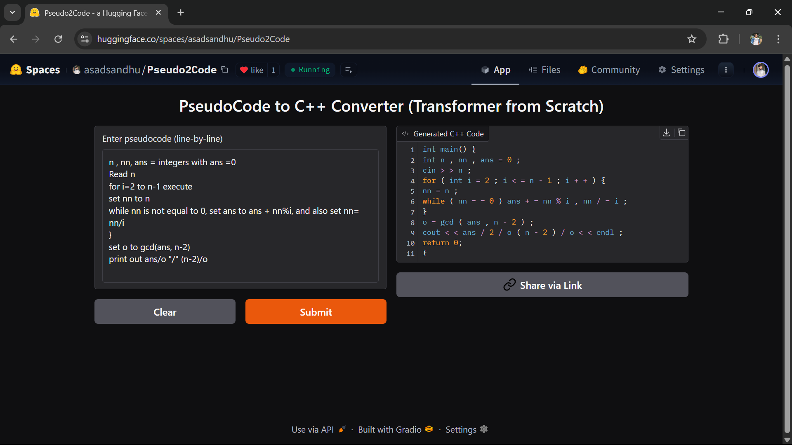

# 🚀 Pseudocode2Cpp – Transformer-based Pseudocode to C++ Converter

[](LICENSE)
[](https://www.python.org/)
[](https://huggingface.co/spaces/asadsandhu/Pseudocode2Cpp)
[](https://github.com/asadsandhu/Pseudocode2Cpp)

> A fully custom Transformer-based Sequence-to-Sequence model built from scratch in PyTorch to convert human-written pseudocode into executable C++ code. Trained on the [SPoC dataset](https://arxiv.org/abs/2005.04326) from Stanford.

---

## 🖼️ Demo

Try it live on **Hugging Face Spaces**:  
👉 https://huggingface.co/spaces/asadsandhu/Pseudocode2Cpp



---

## 🧠 Model Architecture

- Developed using the **Transformer** architecture from scratch in PyTorch
- No pre-trained models (pure from-scratch implementation)
- Token-level sequence generation using greedy decoding
- Custom vocabulary construction for both pseudocode and C++ output

```

Input:   Pseudocode lines (line-by-line)
Model:   Transformer (Encoder-Decoder)
Output:  C++ code line for each pseudocode line

```

---

## 📊 Dataset

We used the **SPoC dataset** from Stanford:

- ✅ Clean pseudocode–C++ line pairs
- ✅ Token-level annotations for syntax handling
- ✅ Multiple test splits (generalization to problems/workers)
- ✅ Custom preprocessing and vocabulary building implemented

> 📎 Licensed under [CC BY 4.0](https://creativecommons.org/licenses/by/4.0/)

---

## 📁 Directory Structure

```

.
├── app.py                # Gradio web app for inference
├── train.py              # Transformer training code
├── model.pth             # Trained model weights
├── spoc/                 # Dataset directory
│   └── train/
│       ├── spoc-train.tsv
│       └── split/spoc-train-eval.tsv
├── assets/
│   └── demo.png          # App screenshot
└── README.md             # You're here

````

---

## 🛠️ How to Run Locally

### ⚙️ 1. Clone Repo & Install Requirements

```bash
git clone https://github.com/asadsandhu/Pseudocode2Cpp.git
cd Pseudocode2Cpp
pip install -r requirements.txt
````

Or manually install:

```bash
pip install torch gradio tqdm
```

### 🚀 2. Launch the App

Make sure `model.pth` is present (or train using `train.py`):

```bash
python app.py
```

The app will open in your browser.

---

## 🧪 Training the Model

You can retrain the model using the `train.py` script:

```bash
python train.py
```

By default, it downloads data from the public repo and trains for 10 epochs.
Outputs a `model.pth` file with learned weights and vocab.

---

## 🔧 Key Hyperparameters

| Parameter      | Value       |
| -------------- | ----------- |
| Model Type     | Transformer |
| Max Length     | 128         |
| Embedding Dim  | 256         |
| FFN Dim        | 512         |
| Heads          | 4           |
| Encoder Layers | 2           |
| Decoder Layers | 2           |
| Batch Size     | 64          |
| Epochs         | 10          |
| Optimizer      | Adam        |
| Learning Rate  | 1e-4        |

---

## 🧩 Example Input

```text
Declare variable i and set it to 0
Repeat while i is less than 10
Print i
Increment i by 1
```

### ⏩ Output C++

```cpp
int main() {
int i = 0;
while (i < 10) {
std::cout << i << std::endl;
i = i + 1;
}
return 0;
}
```

---

## 📦 Deployment

This app is deployed live on:

* **Hugging Face Spaces**: [Pseudocode2Cpp](https://huggingface.co/spaces/asadsandhu/Pseudocode2Cpp)
* **GitHub**: [github.com/asadsandhu/Pseudocode2Cpp](https://github.com/asadsandhu/Pseudocode2Cpp)

---

## 🙌 Acknowledgements

* 📘 **SPoC Dataset** by Stanford University
  Kulal, S., Pasupat, P., & Liang, P. (2020). [SPoC: Search-based Pseudocode to Code](https://arxiv.org/abs/2005.04326)

* 🧠 Transformer Paper: ["Attention is All You Need"](https://arxiv.org/abs/1706.03762)

---

## 🧑‍💻 Author

**Asad Ali**
[GitHub: asadsandhu](https://github.com/asadsandhu)
[Hugging Face: asadsandhu](https://huggingface.co/asadsandhu)
[LinkedIn: asadxali](https://www.linkedin.com/in/asadxali)

---

## 📄 License

This project is licensed under the MIT License.
Feel free to use, modify, and share with credit.
